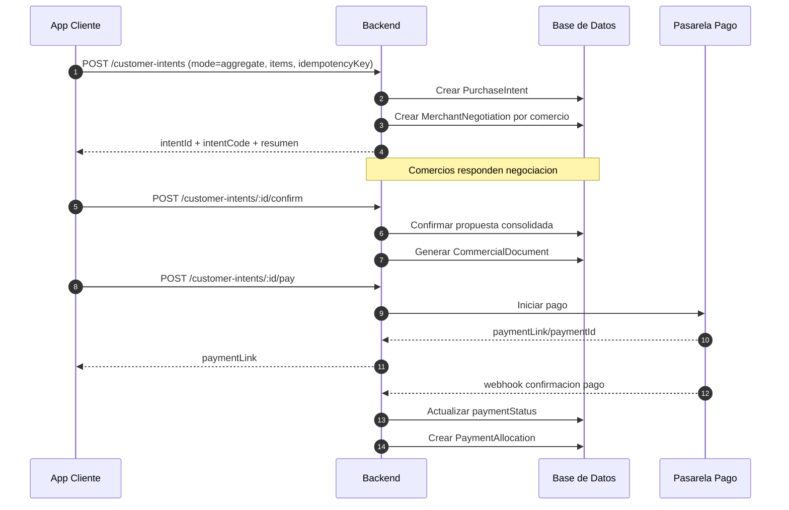

# Propuesta de Modulo Marketplace con Negociacion Agregada y Cotizacion 1 a 1

**Fecha:** 2026-07-01  
**Estado:** Propuesta formal para implementacion
**Prioridad:** Alta (Necesidad explícita de poder salir con el producto)
**Impacto:** Backend + Frontend + Pagos + Reporteria + Operacion comercial

---

## 1) Contexto de negocio

El proceso comercial vigente de Marketplace es:

1. Cliente envia solicitud.
2. Comercio revisa y responde.
3. Se consolida una proforma.
4. Se genera orden.
5. Se procesa pago.

Este modelo tiene sentido y debe mantenerse, porque refleja la negociacion real con cada comercio.

---

## 2) Problema a resolver

Hoy, cuando hay varios comercios en el carrito, el cliente termina viendo multiples solicitudes y potencialmente multiples pagos. Eso genera friccion de UX y dificulta trazabilidad integral para soporte, reportes y conciliacion.

---

## 3) Objetivo de la propuesta

Cerrar el modulo Marketplace con dos modos coexistentes, sobre un dominio unificado:

1. Modo A: Negociacion agregada multi comercio.
2. Modo B: Cotizacion directa 1 a 1 con un comercio.

En ambos casos se conserva la logica de negociacion previa (solicitud/proforma) antes de orden y pago.

---

## 4) Decision arquitectonica

Implementacion backend-first con un modelo de intencion de compra y negociacion por comercio.

Entidades principales:

1. `PurchaseIntent` (entidad madre visible para cliente).
2. `MerchantNegotiation` (una por comercio).
3. `CommercialDocument` (proforma/orden resultante).
4. `PaymentAllocation` (asignacion de pago consolidado).

---

## 5) Modos de flujo

## 5.1 Modo A - Negociacion agregada (multi comercio)

1. Cliente envia una sola `PurchaseIntent` con items de N comercios.
2. Backend crea N `MerchantNegotiation`.
3. Cada comercio responde su parte (acepta, rechaza o propone ajuste).
4. Cliente ve estado consolidado en una sola vista.
5. Cliente confirma propuesta consolidada.
6. Se genera documento comercial final (proforma/orden segun regla).
7. Se habilita pago.

## 5.2 Modo B - Cotizacion 1 a 1

1. Cliente crea una `PurchaseIntent` con `mode = one_to_one`.
2. Solo participa un comercio.
3. Se negocia y se confirma en flujo puntual.
4. Se genera proforma/orden.
5. Se habilita pago.

---

## 6) Estados recomendados

## 6.1 Estado de PurchaseIntent (global)

1. `draft`
2. `submitted_for_review`
3. `partially_responded`
4. `ready_for_customer_confirmation`
5. `customer_confirmed`
6. `order_created`
7. `paid`
8. `cancelled`

## 6.2 Estado de MerchantNegotiation (por comercio)

1. `pending_review`
2. `quoted`
3. `rejected`
4. `expired`
5. `accepted_by_customer`

## 6.3 Regla de pago

No se procesa pago en `submitted_for_review` ni en `partially_responded`.  
El pago se habilita solo cuando la intencion esta en `customer_confirmed` o `order_created`.

---

## 7) Modelo de datos propuesto

## 7.1 PurchaseIntent

Campos sugeridos:

1. `_id`: string
2. `intentCode`: string (ej: `PI-2026-000123`)
3. `mode`: `aggregate | one_to_one`
4. `customerId`: string
5. `customerDocument`: string
6. `status`: enum
7. `paymentStatus`: enum
8. `paymentMethodPreference`: string | null
9. `subtotal`: number
10. `discount`: number
11. `vat`: number
12. `total`: number
13. `currency`: string
14. `merchantNegotiationIds`: string[]
15. `createdAt`: ISODate
16. `updatedAt`: ISODate
17. `submittedAt`: ISODate | null
18. `metadata`: object

## 7.2 MerchantNegotiation

Campos sugeridos:

1. `_id`: string
2. `intentId`: string
3. `organizationUUID`: string
4. `branchUUID`: string
5. `status`: enum
6. `itemsDetail`: object[]
7. `subtotal`: number
8. `vat`: number
9.  `total`: number
10. `notes`: string | null
11. `expiresAt`: ISODate | null
12. `createdAt`: ISODate
13. `updatedAt`: ISODate

## 7.3 PaymentAllocation

Campos sugeridos:

1. `_id`: string
2. `intentId`: string
3. `paymentId`: string
4. `allocations`: array
5. `status`: enum
6. `createdAt`: ISODate

Estructura `allocations`:

1. `merchantNegotiationId`: string
2. `amount`: number
3. `currency`: string
4. `status`: `pending | applied | failed | reversed`

---

## 8) Contratos API propuestos

## 8.1 Crear intencion de compra

**POST** `/customer-intents`

Request:

```json
{
  "mode": "aggregate",
  "customer": {
    "clientId": "cl_123",
    "name": "Juan",
    "email": "juan@mail.com",
    "phone": "0999999999",
    "address": "Av. Principal"
  },
  "paymentMethodPreference": "Transferencia bancaria",
  "currency": "USD",
  "items": [
    {
      "itemCode": "itm_001",
      "itemName": "Producto A",
      "itemIsVat": true,
      "itemBasePrice": 10.5,
      "itemQuantity": 2,
      "organizationUUID": "org_1",
      "branchUUID": "br_1"
    },
    {
      "itemCode": "itm_002",
      "itemName": "Producto B",
      "itemIsVat": false,
      "itemBasePrice": 25,
      "itemQuantity": 1,
      "organizationUUID": "org_2",
      "branchUUID": "br_9"
    }
  ],
  "idempotencyKey": "a4f90f7c-4f45-40f1-89f1-8de6f4507fcb"
}
```

Response:

```json
{
  "response": true,
  "data": {
    "intentId": "pi_abc123",
    "intentCode": "PI-2026-000123",
    "status": "submitted_for_review",
    "paymentStatus": "pending",
    "total": 52.2,
    "merchantNegotiations": [
      {
        "merchantNegotiationId": "mn_1",
        "organizationUUID": "org_1",
        "branchUUID": "br_1",
        "status": "pending_review"
      },
      {
        "merchantNegotiationId": "mn_2",
        "organizationUUID": "org_2",
        "branchUUID": "br_9",
        "status": "pending_review"
      }
    ]
  }
}
```

## 8.2 Consultar intenciones del cliente

**GET** `/customer-intents/my?limit=20&page=1`

## 8.3 Consultar detalle de intencion

**GET** `/customer-intents/:intentId`

Incluye:

1. Cabecera global.
2. Negociaciones por comercio.
3. Resumen consolidado.
4. Trazabilidad de cambios.

## 8.4 Confirmar propuesta consolidada

**POST** `/customer-intents/:intentId/confirm`

Efecto:

1. Marca las negociaciones seleccionadas como aceptadas por cliente.
2. Genera documento comercial (`proforma` u `order` segun regla de negocio).

## 8.5 Iniciar pago de intencion confirmada

**POST** `/customer-intents/:intentId/pay`

Request:

```json
{
  "channel": "payphone",
  "returnUrl": "gb97://payment/return",
  "idempotencyKey": "e7cb711e-0a2b-4489-a5f3-bf5f091f58b8"
}
```

---

## 9) Reglas de negocio criticas

1. **Negociacion previa obligatoria:** no hay pago antes de confirmacion del cliente.
2. **Idempotencia obligatoria:** evitar duplicados en create intent y start payment.
3. **Consistencia de montos:** total global = suma de negociaciones aceptadas.
4. **Trazabilidad completa:** eventos por cada transicion de estado.
5. **Aislamiento por comercio:** cada comercio gestiona solo su parte.

---

## 11) Plan de implementacion por fases

## Fase A - Backend base

1. Crear modelos `PurchaseIntent`, `MerchantNegotiation`, `PaymentAllocation`.
2. Implementar endpoints `POST/GET /customer-intents`.
3. Implementar idempotencia y validaciones de ownership.

## Fase B - Frontend agregado

1. Cambiar envio de carrito para crear una sola `PurchaseIntent` agregada.
2. Crear listado y detalle de intenciones en vista cliente.
3. Mantener fallback al flujo actual con feature flag.

## Fase C - Flujo 1 a 1

1. Crear accion de cotizacion 1 a 1 desde detalle de producto/comercio.
2. Reusar mismo dominio (`mode = one_to_one`).

## Fase D - Confirmacion y conversion comercial

1. Implementar `POST /customer-intents/:id/confirm`.
2. Generar proforma/orden segun regla comercial.

## Fase E - Pagos

1. Implementar `POST /customer-intents/:id/pay`.
2. Aplicar asignacion y conciliacion de pago.

## Fase F - Deprecacion

1. Monitorear adopcion y estabilidad.
2. Retirar endpoints/pantallas legacy cuando el nuevo flujo este estable.

---

## 12) Criterios de aceptacion (DoD)

1. Cliente gestiona una sola entidad madre por operacion (agregada o 1 a 1).
2. El estado global y por comercio es visible y consistente.
3. No se habilita pago antes de confirmacion comercial.
4. Reintentos con misma clave idempotente no duplican operaciones.
5. El flujo 1 a 1 permanece disponible para negociacion puntual.
6. Las metricas y auditorias estan activas en produccion.

---

## 13) Secuencia de alto nivel (modo agregado)



---

## 14) Conclusiones y Recomendaciones

1. Se mantiene la logica comercial real (solicitud -> respuesta -> proforma/orden -> pago).
2. Se resuelve la fragmentacion de UX con una entidad madre consolidada.
3. Se habilitan dos modos (agregado y 1 a 1) sin duplicar arquitectura y se mantiene compatibilidad.
4. Es necesario que para una siguiente fase se resuelva una estrategia más dinámica, dónde cada comercio tenga bien definido su stock y así pasen directamente a un flujo de compra directa.